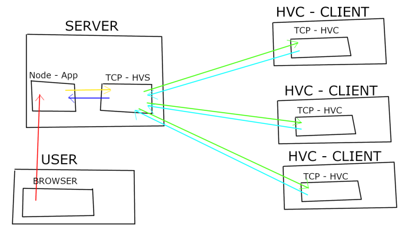

# Web Watch
## Description
This project should give people the opportunity to store snapshots of websites at a given time.

## Table of Contents  

* [Project Information](https://github.com/S1mple133/WebWatch#project-information)
* [How to Use WebWatch](https://github.com/S1mple133/WebWatch#how-to-use-webwatch)
* [Project Summary](https://github.com/S1mple133/WebWatch#project-summary)
* [Project Methodology](https://github.com/S1mple133/WebWatch#project-methodology)
* [Hash Validation](https://github.com/S1mple133/WebWatch#hash-validation)

## Project Information
Organization: HTL Leonding  
Project Title: Web Watch  
Timeframe: N/A  
Prepared By: Aichinger Niklas, Pavelescu Darius  

## How to Use WebWatch
### Creating an Account
To start using webwatch, you will need an account, so hit the "Sign-Up" button and create an account.  

  

After you did that, visit the Sign-Up page again and click on the Log-in Button to log in.  

  

### Taking a Snapshot
After being logged in, you should visit "Save Website" from the navigation bar.  

Paste the link in the "URL" input bar and click on the Submit button.  

Wait patiently until you get redirected to the homepage.  

### Viewing your saved websites
After storing the website, you can easily access it by visiting the "Show Websites" menu from the navbar.

## Project Summary
### Technical Details
The actual Files are saved in PDF and HTML format on our servers to minimize the price that the user has to pay to store a website on the blockchain.  

The next step is to create a unique Hash. The hash uses the MD5-Algorithm and it contains the HTML Code of the website and its URL.  

The web3 Library lets us connect to the ethereum blockchain, but in order to connect to it, we would also need a Node, which is running in the blockchain. The Infura API helps us with this problem by allowing us to use their Node to Deploy Contracts in the ethereum network.  

The hash is then stored in the blockchain and it is linked to the user that requested the snapshot.
When the user wants to see the website, we use the same algorithms to hash the HTML code thats stored on our servers. If the calculated hash is the same as the hash that’s stored on the blockchain, it means that the files did not change. The user becomes 2 links. One leads him to the PDF and the other one to the HTML.  

## Project Methodology
### Aproach Summary
#### Aproach
By using blockchain we are guaranteed that everything thats saved is unchangeable/ undeleteable. Which in our case will be hashes of a website. The website source code will be stored on our servers to reduce cost.

#### Organization
We will have meetings where we discuss new features, which we then implement together or alone. After every feature, the code will be pushed to github from where the next member of the project can continue to work.

#### Tools we used

* ethereum blockchain
* bootstrap
* nodejs
    * web3 - Access blockchain from nodejs.
    * Infura API - Node on the eth blockchain.
    
#### Addressing changes
As mentioned in the aproach, we will have online meetings, a call of some kind or via chat. After we discussed how we will implement certain changes, we use visual studio code live share to work together on the same change or we will decide who will implement the change. After the change is finished the member/members who worked on the change will then proceed to push the code to github.

## Hash Validation

Red – User sends request to save website from URL 
Yellow – Node App sends request to TCP Hash Verification Server App to verify HASH 
Green – Send Request to Hash Verification Clients to calculate HASH 
Cyan – Replies with calculated HASH 
Blue – Replies with HASH with the most frequent HASH 
Node Hash compares his own hash with the received one and adds it to the blockchain if they are equal 